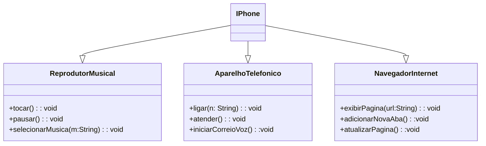

# controleFluxoDiagramaDio

```mermaid

classDiagram
    IPhone --|> ReprodutorMusical
    IPhone --|> AparelhoTelefonico
    IPhone --|> NavegadorInternet
    class ReprodutorMusical{
      +tocar(): void
      +pausar(): void
      +selecionarMusica(m:String): void
    }
    class AparelhoTelefonico{
      +ligar(n: String): void
      +atender(): void
      +iniciarCorreioVoz():void
    }
    class NavegadorInternet{
      +exibirPagina(url:String): void
      +adicionarNovaAba():void
      +atualizarPagina():void
    }

```
